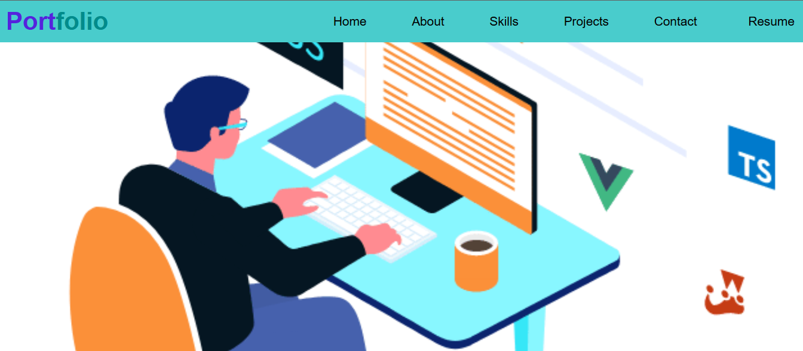

# Portfolio Website

# Introduction
   ###  
   A dynamic, responsive portfolio website developed using React to showcase 
   my technical skills, professional experience, and personal projects. This portfolio serves as a comprehensive digital presence, providing visitors with a seamless navigation experience and insight into my expertise. It features interactive sections designed to highlight key aspects of my career, while demonstrating my proficiency in front-end development, UI design, and modern web technologies.

# 💻 Tech Stack:

 

# 💻 DEPLOYED LINK:
    https://gowsalya-gopalakrishnan.github.io/Portfolio_Website/#/

# DIRECTORY STRUCTURE

    Front Page =>  Home -> About -> Skills -> Projects -> Contact

# FEATURES
###
✧ Interactive Navigation: Smooth transitions between sections with React Router, ensuring a responsive and user-friendly experience across devices.
    
✧ Home Section: An engaging, visually appealing introduction with concise information about my professional background and expertise.
    
✧ About Section: A comprehensive overview of my career journey, values, and personal development.
    
✧ Skills Section: A well-structured list of technical competencies, accompanied by intuitive icons and progress bars that highlight my proficiency with each tool or technology.
    
✧ Projects Showcase: A dynamic display of selected projects, where each project is represented by clickable image links that open detailed project descriptions and live demos in new tabs, enabling users to directly interact with my work.
    
✧ Resume Section: An easily accessible and downloadable version of my resume, consistently     updated to reflect my latest skills and achievements.

# 💻 SCREENSHOTS:

